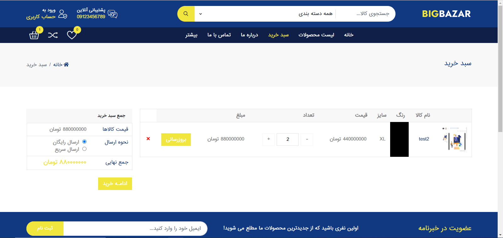

# Django Projects CV

این یک پروژه فروشگاهی کامل با استفاده از جنگو به عنوان بک اند و فرانت اند میباشد.

##  موضوعات مهم پروژه
- [تکنولوژی-ها](#تکنولوژی-ها)
- [شروع-پروژه](#شروع-پروژه)
- [ویژگی-های-سایت](#ویژگی-های-سایت)
    - [حساب-کاربری](#حساب-کاربری)
    - [سیستم-مدیریت-محتوا](#سیستم-مدیریت-محتوا)
    - [سبد-خرید](#سبد-خرید)
    - [خرید-نهایی](#خرید-نهایی)


## تکنولوژی-ها
<p align="center">
<a href="https://www.python.org" target="_blank">  </a>
<a href="https://git-scm.com/" target="_blank">  </a>
<a href="https://www.djangoproject.com/" target="_blank">  </a>
<a href="https://www.selenium.dev/" target="_blank">  </a>
<a href="https://sqlite.org/index.html" target="_blank">  </a>
</p>

## شروع-پروژه
```bash
git clone https://github.com/erfan-karimii/Shop_CV
cd yt_clone
pip install -r requirment.txt
cd core
python manage.py runserver
```
در نظر داشته باشید ساخت یک محیط مجازی و استفاده از ان برای نصب پکیج ها همیشه ایده خوبی می باشد.

## ویژگی-های-سایت

### حساب-کاربری
برای ساخت حساب کاربری از احراز هویت با استفاده از شماره تلفن استفاده می  شود.

<p align="center">


</p>

### سیستم-مدیریت-محتوا

برای کنترل محتوای سایت ما یک سیستم کنترل محتوای اختصاصی نوشتیم که همه ی مراحل اضافه , اپدیت , حذف قسمت های مختلف سایت اعم از :محصولات , تبلیغات , فوتر , نوبار و ... را پوشش می دهد


### سبد-خرید

سبد خرید با استفاده از کوکی ها پیاده سازی شده است . یعنی در دیتابیس ذخیره نمی شود و کاربرانی که وارد حساب کاربری خود نشده اند یا برای اولین بار وارد سایت شده اند می تواند محصولات مورد نظرشون را در سبد خرید ثبت کنند.




### خرید-نهایی

با استفاده از درگاه پرداخت زرین پال امکان خرید از سایت وجود دارد. بعد از تایید نهایی , سبد خرید درپروفایل کاربر بخش سبد های خرید قبلی ذخیره می شود.


